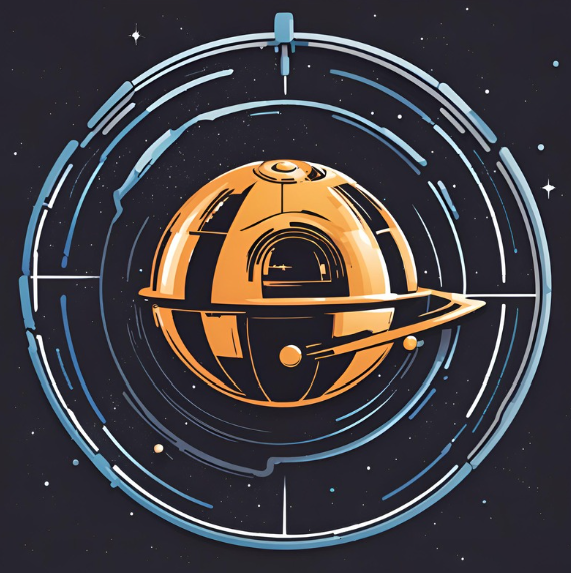

<!-- Improved compatibility of back to top link: See: https://github.com/othneildrew/Best-README-Template/pull/73 -->
<a name="readme-top"></a>
<!--
*** Thanks for checking out the Best-README-Template. If you have a suggestion
*** that would make this better, please fork the repo and create a pull request
*** or simply open an issue with the tag "enhancement".
*** Don't forget to give the project a star!
*** Thanks again! Now go create something AMAZING! :D
-->


<!-- PROJECT SHIELDS -->
<!--
*** I'm using markdown "reference style" links for readability.
*** Reference links are enclosed in brackets [ ] instead of parentheses ( ).
*** See the bottom of this document for the declaration of the reference variables
*** for contributors-url, forks-url, etc. This is an optional, concise syntax you may use.
*** https://www.markdownguide.org/basic-syntax/#reference-style-links
-->
[![Contributors][contributors-shield]][contributors-url]


<!-- PROJECT LOGO -->
<br />
<div align="center">
  <a href="https://github.com/damnordicus/starwars-app">
    
  </a>

<h3 align="center">Star Wars Universe Explorer</h3>

  <p align="center">
    A fun way to view a small part of the Star Wars Universe!
    <br />
    <a href="https://github.com/damnordicus/starwars-app"><strong>Explore the docs »</strong></a>
    <br />
    <br />
    <a href="https://github.com/damnordicus/starwars-app">View Demo</a>
    ·
    <a href="https://github.com/damnordicus/starwars-app/issues/new?labels=bug&template=bug-report---.md">Report Bug</a>
    ·
    <a href="https://github.com/damnordicus/starwars-app/issues/new?labels=enhancement&template=feature-request---.md">Request Feature</a>
  </p>
</div>


<!-- TABLE OF CONTENTS -->
<details>
  <summary>Table of Contents</summary>
  <ol>
    <li>
      <a href="#about-the-project">About The Project</a>
      <ul>
        <li><a href="#built-with">Built With</a></li>
      </ul>
    </li>
    <li>
      <a href="#getting-started">Getting Started</a>
      <ul>
        <li><a href="#prerequisites">Prerequisites</a></li>
        <li><a href="#installation">Installation</a></li>
      </ul>
    </li>
    <li><a href="#usage">Usage</a></li>
    <li><a href="#roadmap">Roadmap</a></li>
    <li><a href="#Lessons">Lessons</a></li>
    <li><a href="#contributing">Contributing</a></li>
    <li><a href="#license">License</a></li>
    <li><a href="#contact">Contact</a></li>
    <li><a href="#acknowledgments">Acknowledgments</a></li>
  </ol>
</details>


<!-- ABOUT THE PROJECT -->
## About The Project

<a href="https://github.com/damnordicus/starwars-app">
    
  </a>

An interactive view into the Star Wars universe that encourages you to check out some of the planets, and see what films they're in and see what characters are on them. 

<p align="right">(<a href="#readme-top">back to top</a>)</p>


### Built With

* [![React][React.js]][React-url]
* [Star Wars API][https://swapi.dev/]]

<p align="right">(<a href="#readme-top">back to top</a>)</p>


<!-- GETTING STARTED -->
## Getting Started

To get a local copy up and running, follow these steps.

### Prerequisites

Things you need to use the software and how to install them.

* npm
  ```sh
  npm install npm@latest -g
  ```

### Installation

1. Clone the repo
   ```sh
   git clone https://github.com/damnordicus/starwars-app.git
   ```
2. Install NPM packages
   ```sh
   npm install
   ```
3. Run it!
   ```
   npm start
   ```

<p align="right">(<a href="#readme-top">back to top</a>)</p>


<!-- USAGE EXAMPLES -->
## Usage

Using your mouse, you control the ship by clicking and holding the left or right mouse buttons, along with using the scroll ability.

Left mouse button (click and hold): allows you to look all around you.
Right mouse button (click and hold): lets you slide up/down/left/right while facing the same direction.
Scroll in/out: zoom in/out.

If there's a planet visible on your screen, you can put your mouse cursor over it, and it's name will show up with a ring surrounding the planet to show which planet is currently in question. 

Clicking on a planet will automatically pilot the ship directly to the planet and stop leaving the planet in the center of your screen. During this travel, a pop up will show all of the details of that planet, including the characters from that planet, and the films which that planet has been in.

If you don't want to travel with the ship, the header bar has a drop down to allow you to choose a planet, and it will show you the same pop up with information on that planet, it just won't have the camera travelling there at this time. 

<p align="right">(<a href="#readme-top">back to top</a>)</p>


<!-- ROADMAP -->
## Roadmap

_EDIT THIS SECTION_

- [ ] THREE.js implementation
- [ ] Galactic View Creation
- [ ] Nav Component Creation
    - [ ] Camera Position Controls (THREE.js)
    - [ ] Select Bar
- [ ] Info Component Creation
    - [ ] Planet Info
    - [ ] Movies Screen
    - [ ] Characters Screen

## Future Updates

- The ability to fast travel (camera movement) to the planet selected from the header.
- Allow user to click on the films and characters to get more detailed information from the selected planet pop up.
- Ability to view all of the Starwars planets instead of just the first 10.

See the [open issues](https://github.com/damnordicus/starwars-app/issues) for a full list of proposed features (and known issues).

<p align="right">(<a href="#readme-top">back to top</a>)</p>

<!-- Lessons -->
## Lessons

### Passing commands to Three.js from outside files
  Our application's 3D landscape visuals and controls were built upon the THREE.js library. This was extremely useful as it provided a playground to operate creatively and build our galaxy. As seen while navigating through our rendered space, the camera controls in the library provided us with the ability to accomplish engaging and intuitive visual feats for the user. We ran into issues when exploring implementations of camera positioning from outside sources. We implemented the THREE.js library in our three.js file by adding functionality to a large-use effect rendered on start-up. This single render ensured the user wouldn't be randomly teleported 'back to start' because of a dependency update. This implementation ended up constraining our abilities and would be the case for a large refactor had we had more time to do so.
  The feature which identified this issue is the planets dropdown tab in the header. Our vision was that upon clicking a planet, the user would be teleported to the view of that associated planet. Following 3-4 hours of pair programming, we were unable to find a solution where we could 1) identify the select element changed value, 2) extract that value to pass it to three.js, and 3) update the camera position based on the randomly generated position of our planets on startup, step 3 being the problem child.

<!-- CONTRIBUTING -->
## Contributing

Contributions are what make the open source community such an amazing place to learn, inspire, and create. Any contributions you make are **greatly appreciated**.

If you have a suggestion that would make this better, please fork the repo and create a pull request. You can also simply open an issue with the tag "enhancement".
Don't forget to give the project a star! Thanks again!

1. Fork the Project
2. Create your Feature Branch (`git checkout -b feature/AmazingFeature`)
3. Commit your Changes (`git commit -m 'Add some AmazingFeature'`)
4. Push to the Branch (`git push origin feature/AmazingFeature`)
5. Open a Pull Request

<p align="right">(<a href="#readme-top">back to top</a>)</p>


<!-- CONTACT -->
## Contact

Project Link: [https://github.com/damnordicus/starwars-app](https://github.com/damnordicus/starwars-app)

<p align="right">(<a href="#readme-top">back to top</a>)</p>


<!-- ACKNOWLEDGMENTS -->
## Acknowledgments

* Galvanize Instructors
* PST Working Schedule Superiority
* Coffee

<p align="right">(<a href="#readme-top">back to top</a>)</p>


<!-- MARKDOWN LINKS & IMAGES -->
<!-- https://www.markdownguide.org/basic-syntax/#reference-style-links -->
[contributors-shield]: https://img.shields.io/github/contributors/damnordicus/starwars-app.svg?style=for-the-badge
[contributors-url]: https://github.com/damnordicus/starwars-app/graphs/contributors
[forks-shield]: https://img.shields.io/github/forks/damnordicus/starwars-app.svg?style=for-the-badge
[forks-url]: https://github.com/damnordicus/starwars-app/network/members
[stars-shield]: https://img.shields.io/github/stars/damnordicus/starwars-app.svg?style=for-the-badge
[stars-url]: https://github.com/damnordicus/starwars-app/stargazers
[issues-shield]: https://img.shields.io/github/issues/damnordicus/starwars-app.svg?style=for-the-badge
[issues-url]: https://github.com/damnordicus/starwars-app/issues
[product-screenshot]: images/screenshot.png
[Next.js]: https://img.shields.io/badge/next.js-000000?style=for-the-badge&logo=nextdotjs&logoColor=white
[Next-url]: https://nextjs.org/
[React.js]: https://img.shields.io/badge/React-20232A?style=for-the-badge&logo=react&logoColor=61DAFB
[React-url]: https://reactjs.org/
